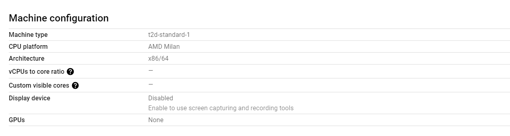
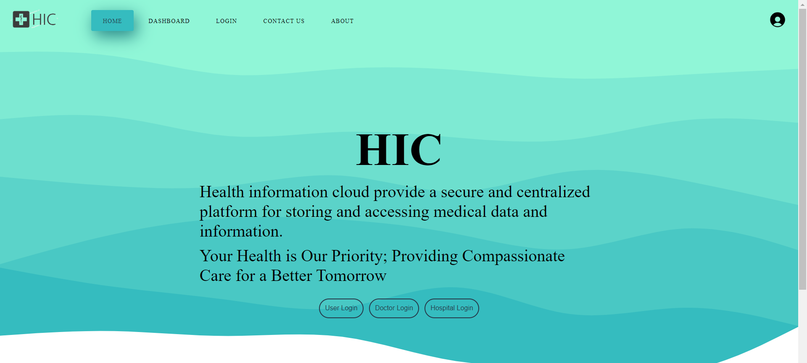

 

  <h2>Universal Patient Database</h2>
  
   
  

     
    <a href="#brief"><strong>Explore the docs »</strong></a>
     
     
    <a href="http://34.131.232.217/index.html">View Demo</a>
    ·
    <a href="https://github.com/shareefmx/GFG_hackathon/issues">Report Bug</a>
    ·
    <a href="https://youtu.be/ADsqF0LGIw8">Demo Video</a>
  

<!-- TABLE OF CONTENTS -->
<Table>
  
Table of Contents

   
  <ol>
    <li><a href="#about-the-project">About The Project</a></li>
    <li><a href="#url">Web App URL</a></li>
    <li><a href="#interact">Interact</a></li>
    <li><a href="#Video">Video Sample of the Project</a></li>
    <li><a href="#brief">Documentation</a></li>
    <li><a href="#contact">Contact</a></li>
  </ol>
</Table>

## About The Project

  Our website is designed to provide a platform for storing and accessing medical reports securely and efficiently.

  Inspired by Government of India's proposal for creating a unified information exchange for medical records, We explored the possible implementation for the same using Aadhar as a medium to Identify patient and store their data as Aadhar number is unique to each citizen.

  Leveraging Google cloud's vast network and it's scale to cater Indian consumer with added backing of versatile vm instances of amd to depoly our website we will be able to revolutionize Indian medical ecosystem.
  
## Web URL

URL :- http://34.131.232.217/index.html 

### Interact/collab with  
  

 </t>
  </t>
  

### Video Sample of the Project

YouTube URL :- https://youtu.be/ADsqF0LGIw8  
                             https://youtu.be/rcQZPIODZzs

## Documentation

  Our website is designed to provide a platform for storing and accessing medical reports securely and efficiently. The website has three main methods of access: user view, doctor view, and hospital view.
  
  In the user view, a patient can log in to the website and access their medical report. The medical report will contain information such as medical history. The patient can view this information and keep track of their health status.
  
  In the doctor view, a healthcare professional can log in to the website and access the medical reports of their patients. They can view the patient's medical history, other relevant information to make informed medical decisions.
  
  In the hospital view, healthcare professionals who work in hospitals can access the medical reports of patients who have been admitted to the hospital. They can view the patient's medical history and add information about the patient's current condition and treatment plan.

  we are Leveraging Google cloud's vast network and it's scale to cater Indian consumer with added backing of versatile vm instances of amd to depoly our website we will be able to revolutionize Indian medical ecosystem.

  In this website, we are leveraging Google Cloud's vast network and scalability to provide a secure and efficient platform for storing and accessing medical reports. By using Google Cloud, we can ensure that our platform is available 24/7 and can handle large amounts of traffic without any downtime.

  In addition, we are also using versatile VM instances from AMD to deploy our website. These instances are optimized for high-performance computing and can handle complex workloads. By using AMD instances, we can ensure that our platform is fast, reliable, and can handle the demands of storing and accessing medical reports.

  Overall, our website provides a secure and efficient platform for storing and accessing medical reports. Patients, doctors, and hospitals can all benefit from having a centralized location to store and access medical information, which can improve the quality of care and help healthcare professionals make informed decisions and by using Google Cloud and AMD instances, we can revolutionize the Indian medical ecosystem by providing a secure and efficient platform for storing and accessing medical reports that is accessible to both patients and healthcare professionals.

## Contact

Name - Muhammed Shareef M  
GitHub - https://github.com/shareefmx  
LinkedIn - [@muhammedshareef](https://www.linkedin.com/in/muhammed-shareef-m-956a70224/)  

Name - Niranjan J  
GitHub - https://github.com/I-NJ  
LinkedIn - [@niranjan](https://www.linkedin.com/in/niranjan096/)  

Name - Nikhil Kamate  
GitHub - https://github.com/Nikhil-Kamate  
LinkedIn - [@nikhilkamate](https://www.linkedin.com/in/nikhil-k-9a457a242/)  

Name - Nisham Ahamed  
GitHub - https://github.com/ahamednisham  
LinkedIn - [@nishamahamed](https://www.linkedin.com/in/nishamahamed/)  

  <h2>Amd Instance Used : <h2>
  
  
  
  
  

